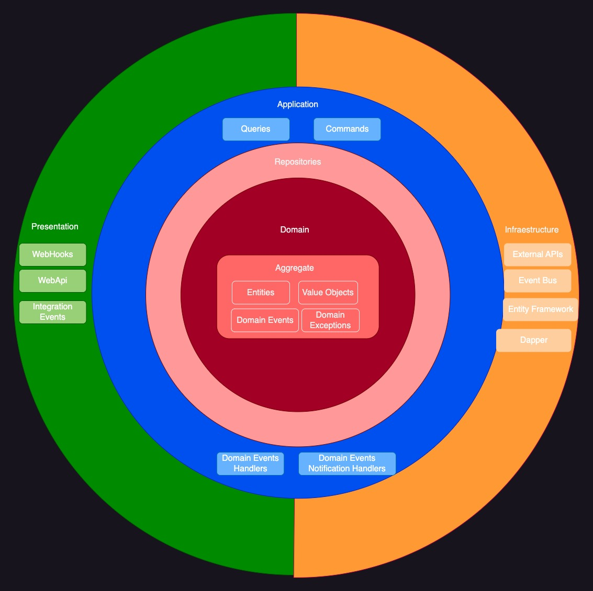

What is the ToDos Project?
=====================
The ToDos Project is a project written in .NET 7.

The goal of this project is implement the most common used technologies and practice to masterize the best way to develop great applications with .NET

## How to use:
- You will need the latest Visual Studio 2022 and the latest .NET Core SDK (at least .NET 7 SDK).
- You will need also Docker Desktop running on your machine.
- To use SetCoordinates on ToDoItem a Google Maps API Key is required.
- To run the project just find and build the solution file JordiAragon.ToDos-Services.sln and use docker-compose as startup project.

## Architecture:

- Full architecture with responsibility separation concerns, SOLID and Clean Code
- Clean Architecture (Onion Architecture with custom Shared Kernel)
- Vertical Slices by feature on each layer.
- Domain Driven Design
- Rich Domain Model with Aggregates and Strong Ids
- Domain/Application Events
- Domain/Application Events Notification
- Outbox Pattern
- CQRS with MediatR and FluentValidation
- Unit of Work
- Repository & Specification
- Custom API Error Handling
- Domain UnitTests

## Custom Shared Kernel:
- This project uses [JordiAragon.SharedKernel v1.0.0](https://github.com/jordiaragonzaragoza/JordiAragon.SharedKernel) building blocks to follow DDD principles and Clean Architecture. 

## Diagram:

## Technologies implemented:

- ASP.NET 7.0
- ASP.NET Core WebApi with JWT Bearer Authentication
- Entity Framework Core 7.0
- MediatR
- AutoMapper
- Autofac
- MassTransit
- Ardalis.Result
- Ardalis.Specification
- Ardalis.SmartEnums
- Ardalis.GuardClauses
- FluentValidator
- Serilog
- Quartz
- Swagger UI with JWT support
- CsvHelper
- Refit
- EasyCaching
- Google Maps API (Geocoding)
- StyleCop & SonarAnalyzer
- xUnit & FluentAssertions

## Features (Pending to complete)

**Separation of concerns by bounded context**
- Check JordiAragon.ToDos.sln. It is a core domain which responsibility manage the ToDos.
- Check JordiAragon.Message.sln. It is a message hub microservice which responsibility is to send messages as abstract hub.

**Account**
- Generate JWT Bearer.
- Basic Authorization to Controllers.

**Contributor**
- Basic API functionality to CRUD Contributor Aggregate with pagination.
- Get assigned ToDo items to a contributor.

**Project**
- Basic API functionality to CRUD Project Aggregate with pagination.
- Get/Set details project with value objects

**ToDo Item**
- Mark as complete or incomplete.
- Assign or remove a contributor
- Reasign to another project.

**Locate a ToDo Item**
- Obtain from Google Maps API the full address, country code, postal code... from the location coordinates.

**Notify ToDo Item expired**
- Notify to contributor if a ToDo Item is expired using pub sub on EventBus using MassTransit.

**Export Project ToDo Items to CSV**
- Export ToDo Items to CSV using CsvHelper library.

**Cross-cutting concerns**
- Outbox pattern to handle the domain event out side the source transaction.
- Publisher-Subscriber pattern on Message Bus (RabbitMq or AzureServiceBus) using MassTransit.
- Flow Control using Ardalis.Result avoiding throwing exceptions.
- API Versioning
- Auditable Entity to track changes.
- Application cache request with invalidation.
- Generic cache repository with invalidation.
- MediatR Pipelines (Decorator pattern)
 - LoggerBehaviour to track all requests.
 - UnitOfWorkBehaviour as a main exception handler to commit or rollback the transaction.
 - ValidationBehaviour to add custom validation per each query or command.
 - CachingBehavior and InvalidateCachingBehavior to apply/remove requests to the cache.
 - DomainEventsDispatcherBehaviour to dispatch domain events before complete the transation.
 - PerformanceBehaviour to track the execution time performance.

## See also this other repository which is the next step on this project.
- [JordiAragon.Cinema](https://github.com/jordiaragonzaragoza/JordiAragon.Cinema) is microservices project with various bounded contexts and complex domain rules.

## Resources and Inspiration

- <a href="https://github.com/ardalis/CleanArchitecture" target="_blank">Ardalis: Clean Architecture</a>
- <a href="https://www.youtube.com/watch?v=SUiWfhAhgQw" target="_blank">Jimmy Bogard: Vertical Slice Architecture</a>
- <a href="https://github.com/jasontaylordev/CleanArchitecture" target="_blank">Jason Taylor: Clean Architecture</a>
- <a href="https://github.com/dotnet-architecture/eShopOnContainers" target="_blank">Microsoft: eShopOnContainers</a>
- <a href="https://github.com/dotnet-architecture/eShopOnWeb" target="_blank">Microsoft: eShopOnWeb</a>
- <a href="https://github.com/kgrzybek/sample-dotnet-core-cqrs-api" target="_blank">Kamil Grzybek: Sample .NET Core REST API CQRS</a>
- <a href="https://github.com/kgrzybek/modular-monolith-with-ddd" target="_blank">Kamil Grzybek: Modular Monolith With DDD</a>

## About:

The ToDos Project was developed by <a href="https://www.linkedin.com/in/jordiaragonzaragoza/" target="_blank">Jordi Aragón Zaragoza</a> 
